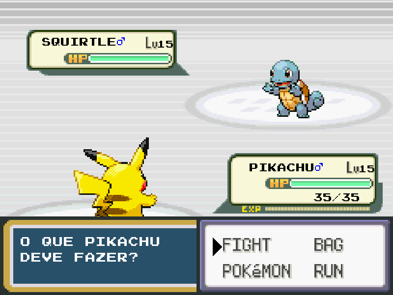

# Trabalho Pokémon (Pygame): Introcomp 2020

Trabalho feito pelos alunos do Introcomp 2020: 
Nomes:
* Antonella dos Santos Mota (Anto)
* Raylan Klitzke Schultz (Nerdedscience)
* Sara Zanetti (SZtti)
<b>Descrição: </b>É uma versão atualizada e modificada do Pokémon 3° geração (Fire Red). Onde é possível encontrar características originais do jogo e outras bem criativas.  
<b>Como jogar: </b>Escolha um Pokémon de sua preferência, escolha um ato (ação, fuga, bolsa) para que o Pokémon o exerça, escolha o movimento ou poção e tente derrote seu oponente.  
<b>Observação: </b>Existe Easter Egg, o descubra e aproveite. O jogo não é 100% parecido com o original, é necessário notar que foi feito por alunos que nunca jogaram qualquer tipo de jogo de pokémons.  
<b>Como abrir o jogo: </b>Você pode abrir ele indo no terminal do seu sistema operacional e digitar python main.py.
Necessário ter instalado o python (versão 3.0 ou superior) e a biblioteca pygame.  
<b>Classificação indicativa: </b>Livre.  
<b>Recomendação: </b>Divirta-se jogando.